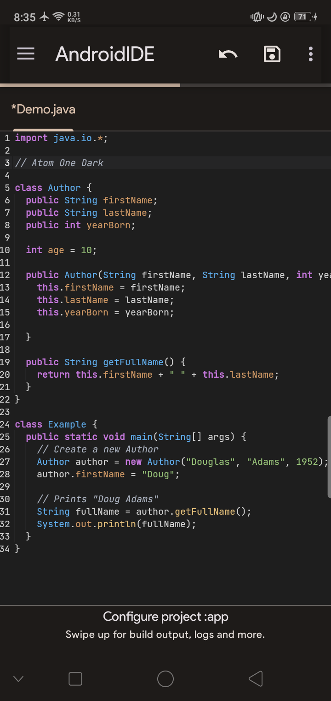
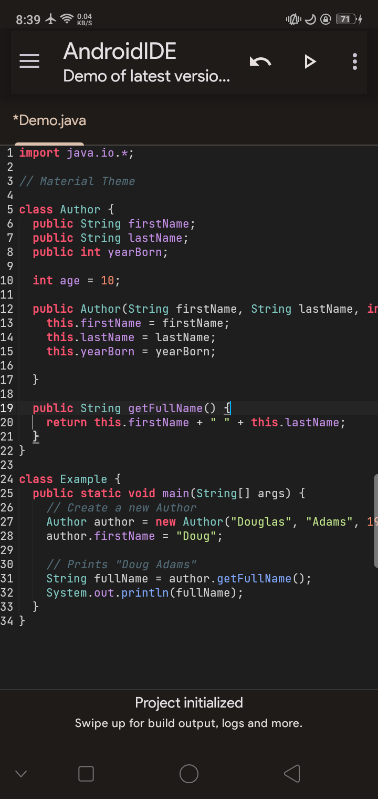
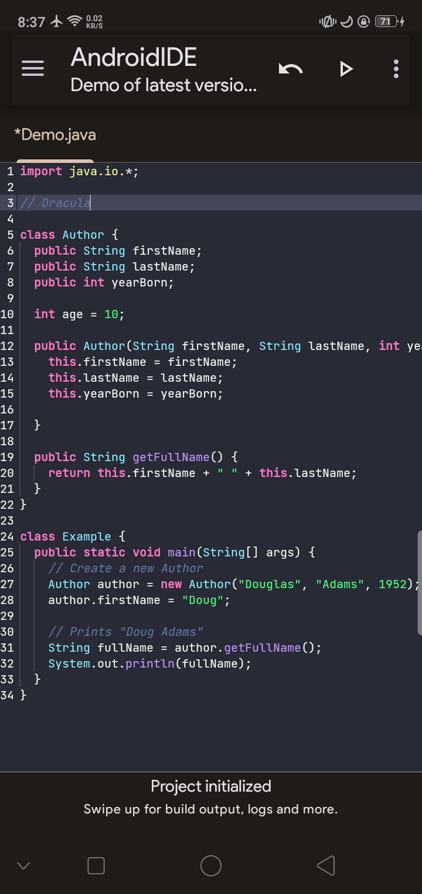
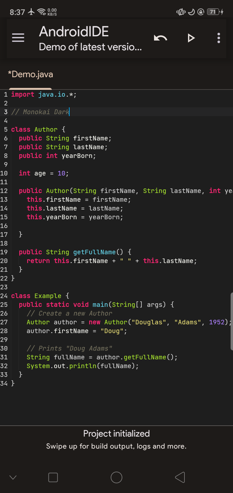
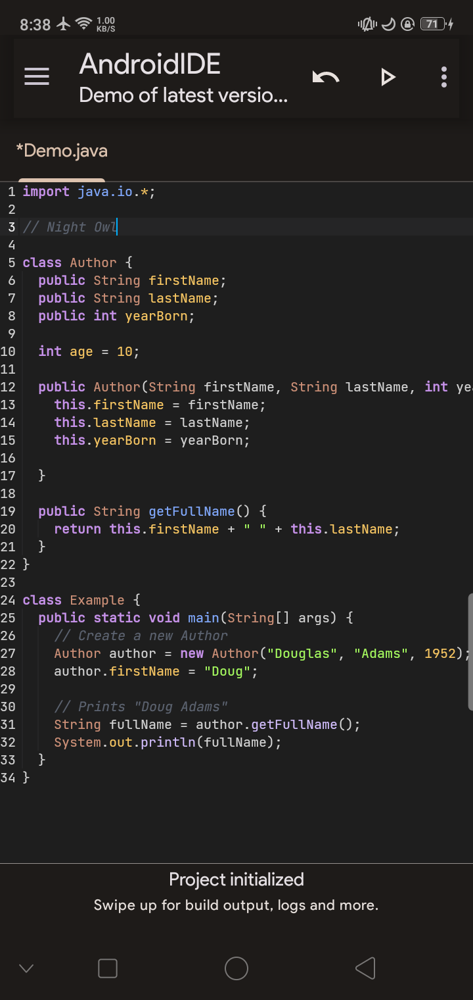
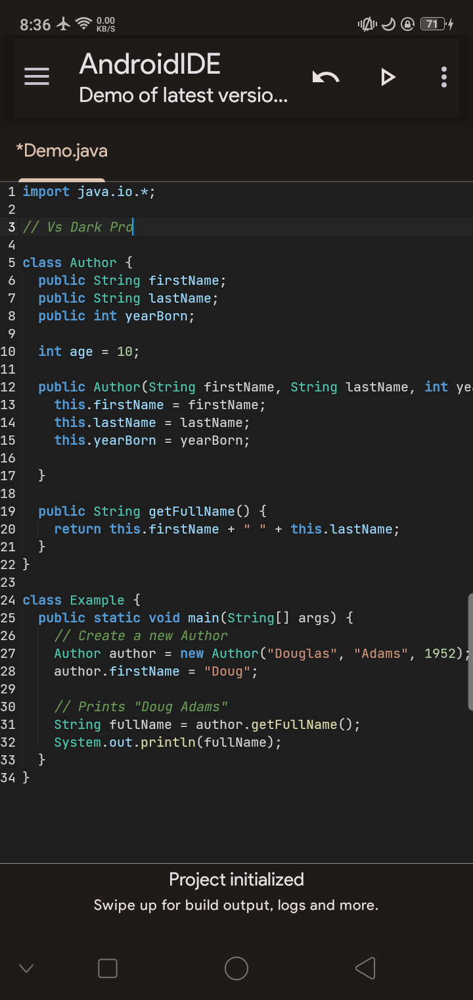

# Vs Code Popular Scheme for AndroidIde

Popular Vs Code color schemes for [Androidide](https://github.com/AndroidIDEOfficial/AndroidIDE) Happy Coding 

## How To Install Schemes

Copy this command and paste it in terminal, after successfully downloading restart the AndroidIde app,

```bashcd $HOME
pkg install git &&
git clone https://github.com/BtAbdul/androidide-scheme.git &&
cd androidide-scheme &&
cp -r * $HOME/.androidide/ui/editor/schemes && 
chmod -R +r $HOME/.androidide/ui/editor/schemes && echo -e "\eColor scheme installed successfully!\e[0m"
echo "Please restart AndroidIDE."
```
 


## Screenshots


Atom One Dark


Material Theme


Dracula


Monokai Dark


Night Owl


Vs Dark Pro

## Contributing

if you want to modify existing schemes or add new schemes please feel free contribute

# Special Thanks
[Kaic Salomão](https://github.com/kaicsm) Thanks for Dracula Theme

## Contact
Feel free to contact me on Telegram at [DevAbdul](https://t.me/devabdul) for any questions or suggestions.
